# Platform engineering 101

Welcome to this workshop on getting started with Platform Engineering with Red Hat Developer Hub (i.e., an open source downstream project of Backstage). In this workshop, we'll guide you through how to set up Red Hat Developer Hub on OpenShift through the free sandbox environment as your Internal Developer Portal, and then how you can start creating and using software templates in this portal to enable your own Internal Developer Platform (IDP). 

If you're unsure of any of these terms, please take a look at the [accompanying slides](slides/WorkshopPlatformEngineering101.pdf) in this GitHub repository - this provides an overview of the theory behind this workshop and intros the key technologies used.

## Overview
This workshop is split into 4 key sections with multiple sub-parts to each. Please refer to the following outline for an idea of what's involved in this workshop:

* **[Step 1: OpenShift enablement](#Step_1)**
  * [1.1 Set up your Developer Sandbox on Red Hat Developer Hub](#Step_1.1)
  * [1.2 Clone excerise manifest files for this workshop](#Step_1.1)
* **[Step 2: Install Red Hat Developer Hub on OpenShift](#Step_2)**
  * [2.1: Install Red Hat Developer Hub in your Developer Sandbox through Helm Charts](#Step_2.1)
* **[Step 3: Integrate with GitHub](#Step_3)**
  * [3.1: Get the credentials for a GitHub application within a GitHub organization](#Step_3.1)
  * [3.2: Create a basic GitHub integration within Developer Hub (i.e., repository creation and scanning)](#Step_3.2)
  * [3.3: Enable GitHub authentication](#Step_3.3)
  * [3.4: Enable GitHub actions (optional)](#Step_3.4)
* **[Step 4: Applying software templates / golden path templates](#Step_4)**
* **[Step 5: Custom (dynamic) plugins](#Step_5)**
  * [5.1: Environment setup](#Step_5.1)
  * [5.2: Plugin development](#Step_5.2)
* **[Step 6: Customizing the Developer Hub instance](#Step_6)**
* **[Step 7: Extra information](#Step_7)**

We've created each of these sections as collapsable segments in the readme to help make it easier to navigate through this workshop. By default they are open, but feel free to collapse them as you move through each step.

***

## Workshop Instructions

<a id="Step_1"></a>
<details open>
<summary>Step 1</summary>

## Step 1: OpenShift enablement
The first step to start the workshop is to have a running OpenShift cluster 
available. During the workshop, the OpenShift cluster and its integrations 
will serve as our internal developer platform. There are two ways to obtain an 
OpenShift cluster:
* From the [Red Hat Developers website](https://developers.redhat.com), 
    which offers tutorials, free e-books, and access to a free OpenShift sandbox.
    => We will opt for this option during this tutorial
* From a demo environment provided for you.

<a id="Step_1.1"></a>

### 1.1 Set up your Developer Sandbox on Openshift
The [Red Hat Developers website](https://developers.redhat.com) 
is Red Hat's central hub for developers, 
offering many resources to build, deploy, and manage applications using 
Red Hat's technologies. It provides access to free e-books,
free tools, downloads, tutorials, 
documentation, and learning paths covering a range of topics like Quarkus, 
cloud-native application development, Kubernetes, 
containers, and AI/ML. Next to that, it offers hands-on labs, interactive guides, 
and insights from 
Red Hat experts. It’s also a gateway to communities, events, and open-source 
projects, making it a comprehensive platform for learning, collaboration, 
and innovation in modern application development.

Last, but not least, it offers a free sandbox, which allows you to start **a free
OpenShift cluster and/or a free OpenShift AI environment**. It is this sandbox that
we will use. 

**Benefits of the sandbox:**
* Free of charge.
* No credit card required.
* OpenShift cluster.
* OpenShift AI platform.

**Drawbacks of the sandbox:**
* Operator framework disabled (i.e., cost control).
* Cluster gets deleted after 30 days, but you can create a new one then.
* Pods get stopped after 12 hours, but you can restart them any time
  (e.g., through the deployment screen in the OpenShift console).

In order to get the OpenShift cluster, you will need to execute the following steps:
* Go to the [Red Hat Developers website](https://developers.redhat.com).
* Log in (or create an account).
* Go to the menu item **Developer Sandbox**.
* Click **Explore the free Developer Sandbox**.
* Click **Start your sandbox for free**.
* Click **Get started** and you will see three available services
  * The OpenShift sandbox.
  * OpenShift dev spaces (an IDE running on OpenShift/Kubernetes), which is accessible through the browser.
  * The OpenShift AI sandbox.
* Now open launch two components that we will use during this workshop:
  * Click **Launch** for Red Hat OpenShift.
  * Click Log in with **dev spaces**. Use this GitHub repo as workspace Git repo URL: 
    ```text
    https://github.com/grace-maarten/platform-engineering-101.git
    ```

> Note: When interacting with an OpenShift cluster, you can make use of the OpenShift CLI. Command line tools can be found by logging in to an OpenShift cluster, clicking the question mark button in the top right corner and selecting the tool you want to download. In case you don't want to configure your local machine, you can make use of Red Hat Dev Spaces. The advantage of using dev spaces (i.e., an IDE running on Kubernetes/OpenShift and accessible through the browser) is that you can configure environments that suit different use cases. E.g., for this tutorial, we've prepared a dev file (i.e., in the root of the project) that provides an installation of node and the OpenShift CLI (i.e., oc).

<a id="Step_1.2"></a>

### 1.2 Clone excerise manifest files for this workshop
You should now have successfully set up your developer sandbox and set up the workspace Git repo. For the purposes of this workshop, you'll also need to clone the exercise manifest files into this repository too. These will be used later on in this workshop.

```shell
mkdir training-exercises
cd training-exercises
git clone https://github.com/maarten-vandeperre/developer-hub-training-exercises.git
```
</details>

<a id="Step_2"></a>
<details open>
<summary>Step 2</summary>

## Step 2: Install Red Hat Developer Hub on OpenShift
We're now ready to install Red Hat Developer Hub on OpenShift. For this you have two options:
1. Using an [Operator](https://www.redhat.com/en/technologies/cloud-computing/openshift/what-are-openshift-operators).
2. Using [Helm charts](https://www.redhat.com/en/topics/devops/what-is-helm).
  
The preferred installation method depends on the type of environment 
you've chosen (e.g., existing OpenShift instance, demo environment or developer sandbox):

* If you already have an OpenShift cluster, you can use the Red Hat Developer Hub Operator as the **Operator Framework is enabled**, so the operator-based installation would be recommended.
* If your OpenShift cluster does **not** have the **Operator Framework enabled**, **or** if you **require more fine-grained control**, the Helm-based installation is the better option.

> Because we are using the Openshift developer sandbox in this workshop, which does not have the operator framework enabled, we will be using the Helm-based installation.

<a id="Step_2.1"></a>

### 2.1: Install Red Hat Developer Hub in your Developer Sandbox through Helm Charts
>You can't choose the namespace within the sandbox: It will be something like
'username + -dev'. Know that you will have to pay attention to the configurations 
later on in this workshop: you'll need to check that the namespace is correct as
most of the manifest are based upon the 'demo-project' namespace.

>We will be using 'developer-hub' as the name of the instance. Feel free to change it
to what you like, but know that you will have to pay attention to the configurations
later on in this workshop: you'll need to check that the name is correct if you
didn't go along with 'developer-hub'.


As mentioned, at the time of publishing, when installing Developer Hub via the Developer Sandbox for Red Hat OpenShift, you need to use a Helm chart. In future releases, this process will be changed to use a dedicated Operator, which will make setting up and configuring the system easier. 

Now that you are in your Developer Sandbox account:

* Start in the Developer viewpoint by selecting **</> Developer** in the upper left corner.
* Select **Administrator** to change to the Administrator viewpoint. You will see a screen that shows your single allowed project on the Developer Sandbox.

  

* Switch back to the **Developer** viewpoint to begin installing Developer Hub.
* Select your project name to enter that project and go to the **Add** screen

  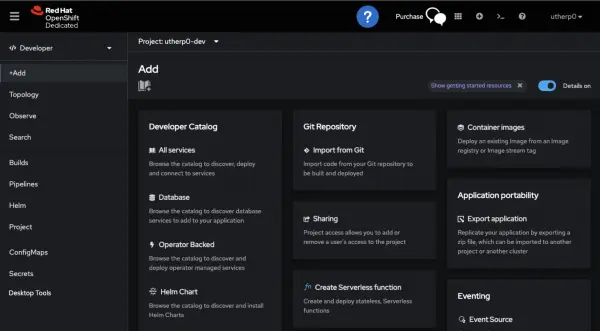

* Now it’s time to install the Developer Hub components using the Helm chart. Under Developer Catalog, select **Helm chart** and type **developer hub** into the search box

  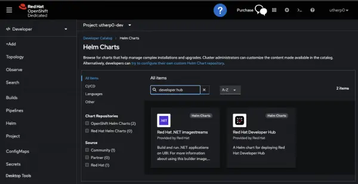

* Click on the **Red Hat Developer Hub** Helm chart

  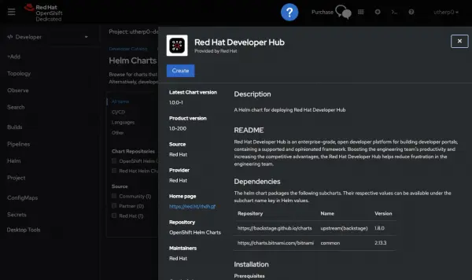

* Click **Create** to reach the Create Helm Release screen

>For the sake of initial simplicity, you will install Developer Hub with all of the defaults, then add additional features (including GitHub authorization) after installation. The advantage of installing Developer Hub onto OpenShift is that we can change the configuration parameters via injected Secrets after we have a running version. Doing this restarts the pods with the new configuration injected as components using appropriately named Secrets, which simplifies customizing and configuring Developer Hub.

When we have an Operator, installation will be even simpler, with configuration options injected directly as components in the Custom Resource.

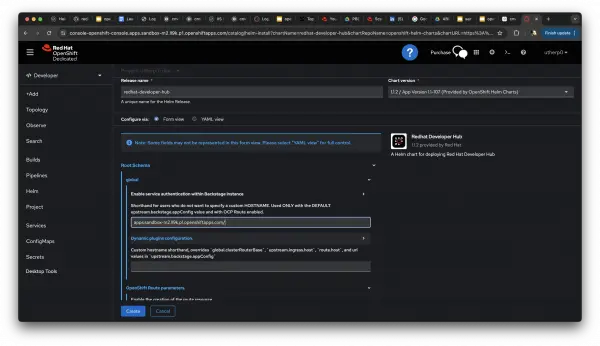

* :warning: Navigate to **Root Schema -> global**. Then under **Enable service authentication within Backstage instance**, enter the required shorthand in the format `apps.{your_sandbox_url}.openshiftapps.com` (see the URL bar at the top of the image above to see where to find this information in your Developer Sandbox URL).

* Click **Create**.

The Helm chart installs the pre-configured components needed for the Red Hat Developer Hub application. In our case, it installs a StatefulSet for the database. Developer Hub uses Postgres as its storage mechanism, and the Helm chart installs and configures the database for you as well as an instance of the Developer Hub application. This application is the controller that serves the UI that the end users consume. 

You, as the platform engineer, control the configuration of this application, which stores its objects and state in the Postgres database. If you leave it for a couple of minutes, the application will install and stabilize.

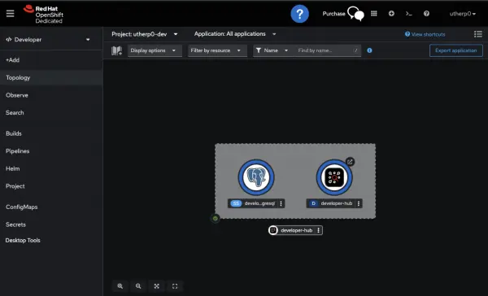

_Info alert: Note: An OpenShift project is effectively a grouping of objects that are accessed and interacted with together._

The roundels (the round edges of the icons) for both the StatefulSet (database) and the application should be blue. There are 3 shades of blue as a pod is launched, each getting darker until the required pods are running and healthy. You can verify that launch is complete by clicking the developer-hub circle to see more details. The circle will show "1 Pod" when you're ready to proceed.

You have now installed a version of Developer Hub, albeit one that needs more configuration so your users can consume it. 

For now, select the **Route** icon in the top-right of the roundel for the developer-hub application, and the screen in Figure 10 will appear in a separate tab. Make note of your route URL, you will need it later.

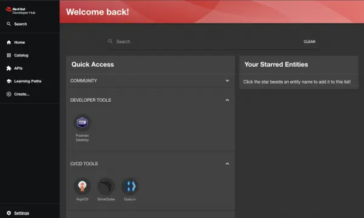

_Info alert: Note: If you see a screen prompting you to log in as Guest or via GitHub, select Guest._

Because you haven’t set up authentication yet, what you see is the guest viewpoint. By default, Developer Hub and Backstage allow a guest user, which the system defaults to in the absence of an authentication method being added. This is why we need to set up GitHub authentication, which is our next step.

> **:warning: When you use the Helm based installation, be aware that the pods don't automatically restart when applying changes. Make sure to kill the Developer Hub when applying new configurations (e.g., dynamic plugins, app config, ...). The reason for this is that the Helm chart does not monitor secrets or configmaps for changes, only what is done through a Helm upgrade. If you want to avoid to delete pods to get updates pushed through, you can use the following command:**
> ```shell
> oc rollout restart deployment/redhat-developer-hub
> ```

</details>

<a id="Step_3"></a>
<details open>
<summary>Step 3</summary>

## Step 3: Integrate with GitHub

Before diving into tasks like setting up software templates, we first need to establish integration with a Git repository. 

In order to get started with the GitHub integration, we will need some data/credentials from your GitHub organization and/or GitHub app: 
* app ID.
* client ID.
* client secret.
* private key (i.e., .pem file).  

<a id="Step_3.1"></a>

### 3.1: Get the credentials for a GitHub application within a GitHub organization

There are advantages of working with a GitHub organization: you can better isolate repositories, you can work together with multiple people without having to share credentials, ….

3.1.a. Create a GitHub organization. (I opt for the "Free" one.)

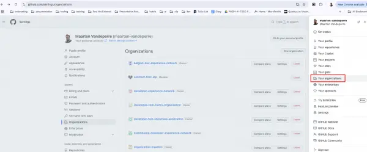
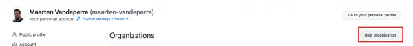

3.1.b. Fill the form and hit **Next**

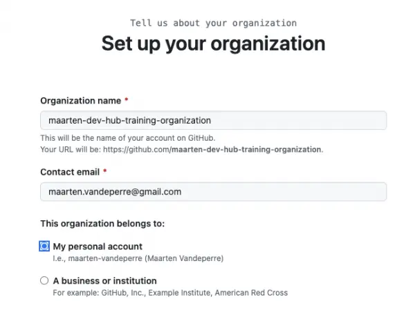

3.1.c. Click **Complete setup**

3.1.d. Go to settings of the organization

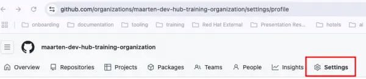

3.1.e. Scroll down to **Developer Settings > GitHub Apps**, not to "GitHub Apps" under Third-party access 


3.1.f. Create GitHub App:

i. Name: for us **developer-hub-training-app**

ii. Homepage URL, i have used https://developers.redhat.com/ (you can fill what you want)

iii. Uncheck the **active** box for webhook

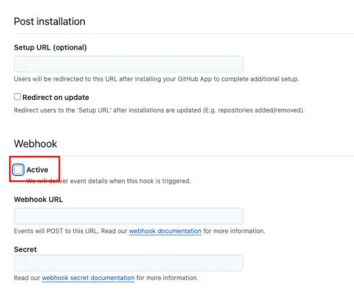

iv. When creating a GitHub App, you must select permissions (i.e., repository and group permissions, but mainly repository permissions) to define the level of access for the app. The permissions required vary depending on your use of the integration:

* Use case: **Reading software components**. Required permissions:
  * Contents: Read-only
  * Commit statuses: Read-only
* Use case: **Reading organization data**. Required permissions:
  * Members: Read-only
* Use case: **Publishing software templates**. Required permissions:

  _Take this one for the rest of this exercise._
  * Administration: Read & write (for creating repositories)
  * Contents: Read & write
  * Metadata: Read-only
  * Pull requests: Read & write
  * Issues: Read & write
  * Workflows: Read & write (if templates include GitHub workflows)
  * Variables: Read & write (if templates include GitHub Action Repository Variables)
  * Secrets: Read & write (if templates include GitHub Action Repository Secrets)
  * Environments: Read & write (if templates include GitHub Environments)

v. Select **Only this account** for "Where can this GitHub App be installed"

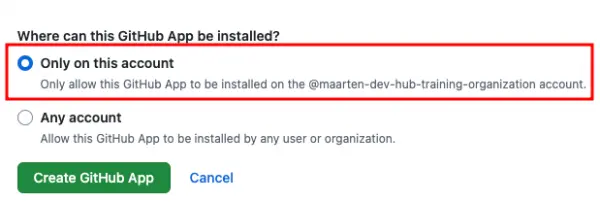

vi. Click **Create GitHub App**.

vii. Get your client and app ID and store it somewhere where you can access it later on.

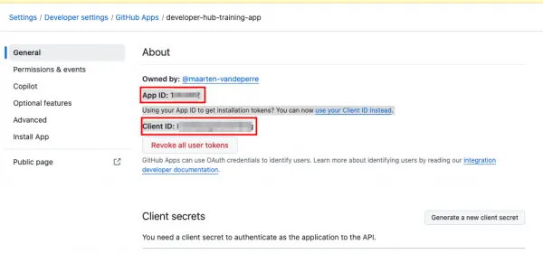

viii. Generate a new client secret.

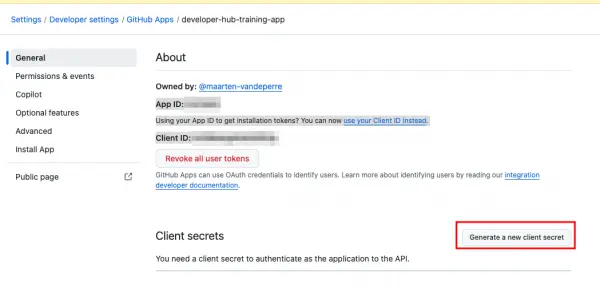

ix. Store the client secret somewhere where you can access it later on.

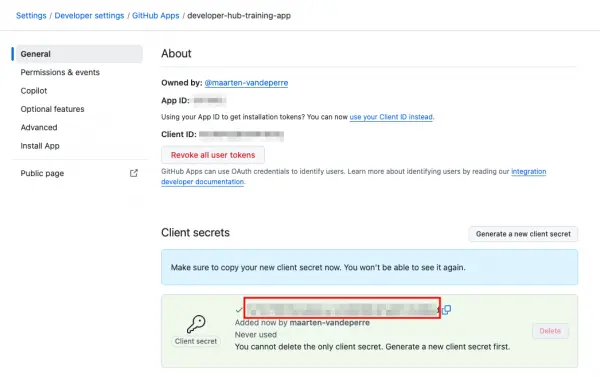

x. Click **Save changes**

xi. Generate a private key. It will trigger the download of .pem file. Store it somewhere where you can access it later on.

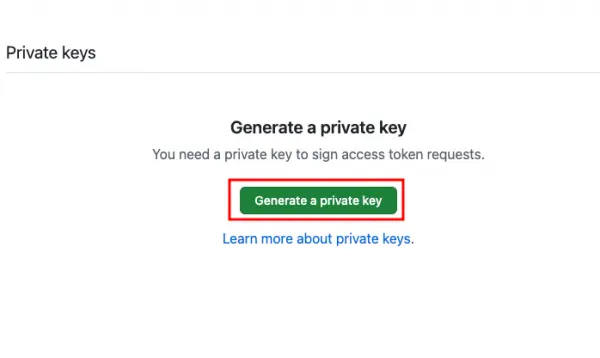

xii. Install the application

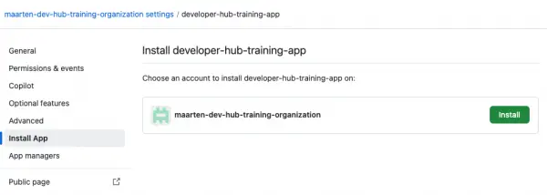

xiii. Click **Install**

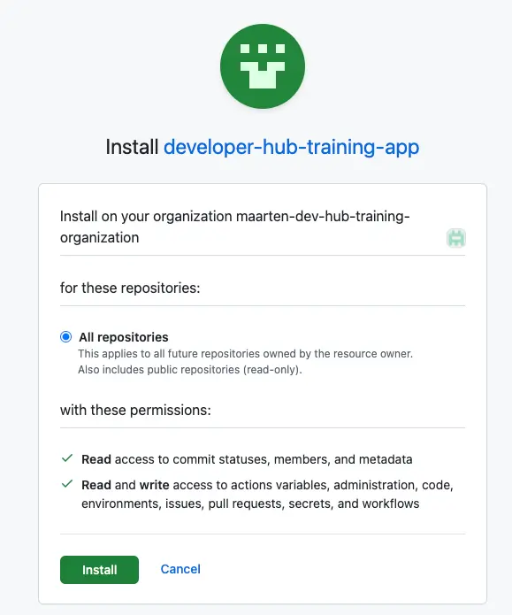


<a id="Step_3.2"></a>

### 3.2: Create a basic GitHub integration within Developer Hub (i.e., repository creation and scanning)

The required manifests are available in the [Developer Hub training exercises repository on GitHub](https://github.com/maarten-vandeperre/developer-hub-training-exercises). For this exercise, all manifests are in the folder ‘github-integrations’, so check it out before going further.

  3.2.a. **Log in** with OpenShift

  As described before, you have the option to work with the UI (i.e., the OpenShift console) or with the command line interface (i.e., oc). Within this workshop I will opt for the command line interface, but if you’d like to work with the UI, feel free to check out the previous exercise
  on the [Developer Hub training exercises repository on GitHub](https://github.com/maarten-vandeperre/developer-hub-training-exercises). (In case you want to work with the UI, because you can’t install the oc command line tool, then you can check out OpenShift dev spaces as well. It will give you an IDE, accessible from the browser, running on OpenShift and already connected to the cluster).

  3.2.b. **Add secrets** and GitHub info into a secret

>This step only applies when you are persuing this workshop together with us. When this is not the case, feel free to reach out or just follow the steps in the section
[3.1: Get the credentials for a GitHub application within a GitHub organization](#Step_3.1)

  Within GitHub, we already created an organization and a GitHub app within that organization. For that GitHub application, we got an application ID, a client ID, a client secret and a private key. This is all information that we will need to pass to our Developer Hub deployment. As it is not safe to put this directly in the application configuration, we will opt for storing it in a secret and linking the secret to the application configuration afterward. 

  In order to get the private key, open the .pem file that was downloaded when you generated a private key:

  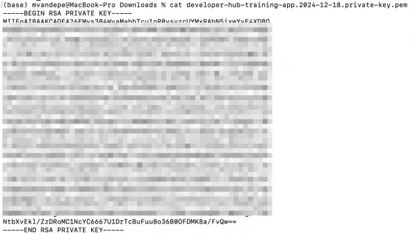

  You can paste the entire block, with the start and the end line, in the secret file secrets_github-credentials.yaml.

  You can create the secret by applying the following YAML definition.

  **!!! Important to note is that you will have to add your credentials to this YAML before applying it. Next to that, make sure that the private key value is aligned properly.**

  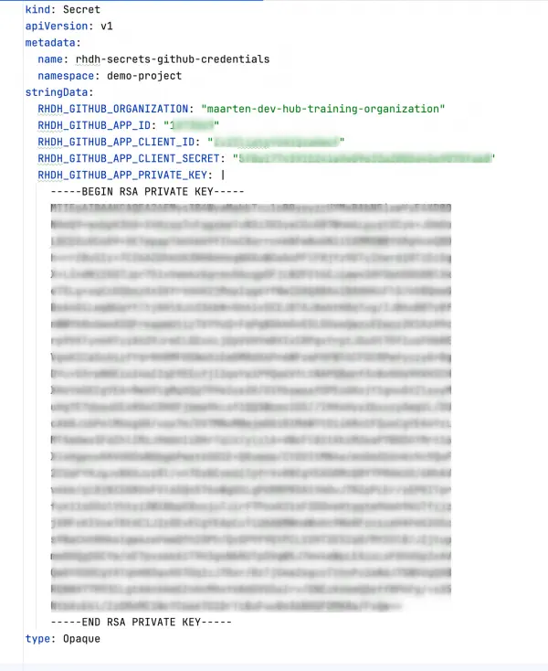

  ```shell
  oc apply -f manifests/secrets_github-credentials.yaml
  ```

  Expected output:

  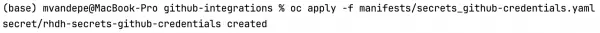

  3.2.c. **Create a dynamic plugins configuration**

  Dynamic plugins in Red Hat Developer Hub enable developers to extend the platform's functionality without modifying the core application. They allow users to create and integrate custom features, tools, or workflows that dynamically load into the platform at runtime. This approach ensures flexibility, as plugins can be updated, added, or removed independently of the core Developer Hub, enabling organizations to tailor the developer experience to their specific needs while maintaining seamless scalability and modularity.
  In order to enable GitHub integration, we will need to add a dynamic plugin for these integration(s) too. This can be done by applying the following YAML definition.
  You can create the secret by applying the following YAML definition.

  ```shell
  oc apply -f manifests/dynamic-plugins-v1.yaml
  ```

  Expected output:

  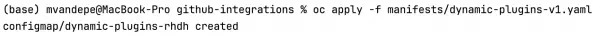

  3.2.d. **Create an application config configuration**

  In Red Hat Developer Hub, the app-config.yaml file is the central configuration file that defines the behavior, integrations, and settings of the Developer Hub instance. It manages the platform’s core functionality and plugins by specifying:

  1. **Backend Services and Integrations**: Configures APIs, authentication mechanisms, and connections to external systems (e.g., GitHub, Kubernetes, CI/CD tools).
  2. **Plugins and Features**: Enables or disables plugins and custom features within the hub.
  3. **Entity Providers**: Defines sources for cataloging software entities, such as Git repositories or cloud platforms.
  4. **UI Customization**: Allows basic customization of themes, navigation, and branding.
  5. **Runtime Behavior**: Sets parameters for caching, logging, and other operational aspects.

  By centralizing configuration, the app-config.yaml file ensures consistency, making it easy to manage, extend, and adapt the Developer Hub to an organization’s evolving requirements.

  In order to enable GitHub integration, we will need to create an app-config file after adding the dynamic plugin for these integration(s). The dynamic plugin will enable the underlying dependency, the config within the app-conf file will configure this dependency. Adding the basic GitHub integration configuration can be done by applying the following YAML definition.

  ```shell
  oc apply -f manifests/app-config-v1.yaml
  ```

  Expected output:

  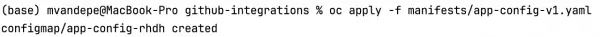

  3.2.e. **Add the dynamic plugins and the application configuration** to the instance configuration

  Now that we have the secrets configured, the dynamic plugins listed, and the application configuration configured, we just need to glue everything together within our Developer Hub instance configuration. This can be done by applying the following YAML definition.

  ```shell
  oc apply -f manifests/instance-config-v1.yaml
  ```

  Expected output:

  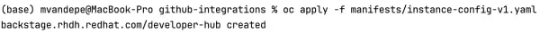

  You can check the status of the newly created pod by running the following command (the newly created pod should get the status ‘Running’):

  ``` shell
  oc get pods -n demo-project -o json | jq '.items[] | 
  select(.metadata.ownerReferences[0].name | 
  startswith("backstage-developer-hub-")) | {POD: .metadata.name, DEPLOYMENT: 
  .metadata.ownerReferences[0].name, Status: .status.phase, StartTime: 
  .status.startTime }'
  ```

  Important note: this configuration should be the last step, or you will have to delete the instance and reinstall it through the YAML definition, as it will crash for secrets or configs not found.
  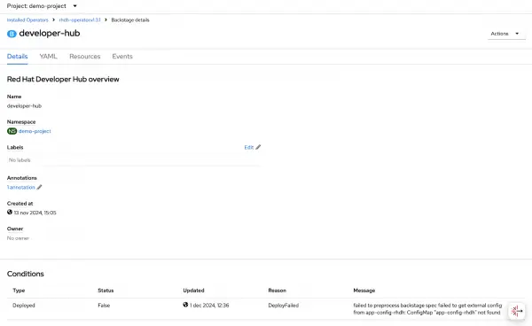

  Now we will wait until the pods restart and we will access Developer Hub. If you are not able to access Developer Hub in this stage, then something went wrong configuration wise. You can rely on the "how to debug" section of previous learning exercise to check what went wrong.

  For me, it started without errors, so let’s go to the next session and try the GitHub integrations. You should be able to see...

  ```shell
  "class":"GithubEntityProvider$1","level":"info","message":"Read x GitHub repositories (x matching the pattern)"
  ```

  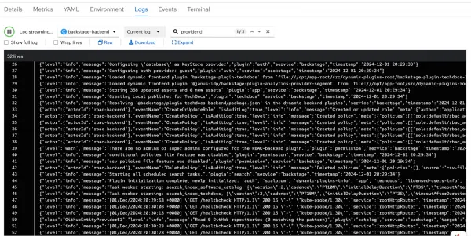

  In case you’re facing "github-provider:providerId refresh failed, HttpError: API rate limit exceeded, you’re required to log in", check if the organization name is correct and that your secret values are mapped correctly. I faced the issue when I made a copy-paste error on the organization name in the app-config file.

<a id="Step_3.3"></a>

### 3.3: Enable GitHub authentication

Up until now, we worked with guest authentication, which is not something we will do in a production setting. There are quite a few supported user providers like OpenID compliant systems (e.g., Keycloak), GitLab, …. For this exercise, we will stick to GitHub authentication.

In order to do so, you will need to:

3.3.a. **Update your GitHub app configuration**

  * Go to your organization’s GitHub Apps and click 'edit'.
 
  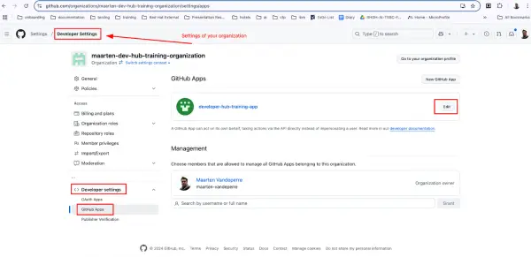

  * Fill the callback URL field with:

  https://backstage-developer-hub-demo-project.apps.cluster-8wcdk.8wcdk.sandbox1893.opentlc.com/api/auth/github/handler/frame

  !! **Be aware**: your base domain will be different from mine. It needs to be the base domain of your Developer Hub instance.

  !! **Be aware (II)**: In case you change clusters, you will need to add an extra callback URL.

  

  * Click 'save changes'

3.3.b. **Add a new plugin** to the dynamic plugins' configuration.

It will be the GitHub org plugin, which is responsible for importing users and groups from GitHub into Developer Hub. You can add it to the dynamic plugins by applying the following YAML manifest: (changes are in between ‘added to enable github authentication’ blocks). (_version is v3, to be aligned with the app-config files, v2 doesn’t exist for the dynamic plugins_).

```shell
oc apply -f manifests/dynamic-plugins-v3.yaml
```

Expected output:

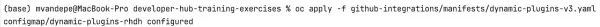

3.3.c. Now that we have the new plugin enabled, we will need to add some configuration for it in the app-config file.

You can do this by applying the following YAML manifest: (_changes are in between ‘added to enable github authentication’ blocks_)

```shell
oc apply -f manifests/app-config-v3.yaml
```

Expected output:

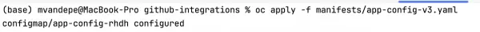

We didn’t need to add anything regarding the GitHub integration part, as it is already configured for previous sections. What you need to do is:

* Add GitHubOrg configuration in the providers section.
* Add GitHub configuration in the auth providers section.
* Set GitHub as a sign in page.

3.3.d. Wait for the pods to restart.

3.3.e. Now, go to the home page of Developer Hub (or log out as guest) and select GitHub login.

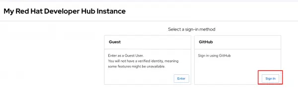

3.3.f. Log in with your GitHub account. 

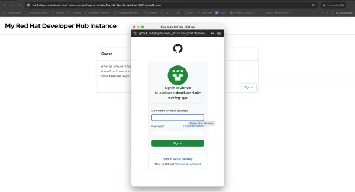

3.3.g. And you’ll see that you’re not the guest user anymore. 

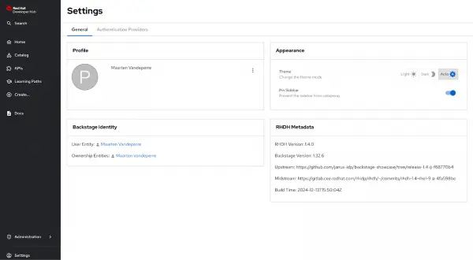

3.3.h. In case you want to disable the option to log in as a guest user, you can do this by applying the following YAML manifest: 

(_changes are in between ‘added to disable guest authentication’ blocks or highlighted with ‘ #changed to enable github authentication’_)

```shell
oc apply -f manifests/app-config-v4.yaml
```

Expected output: 

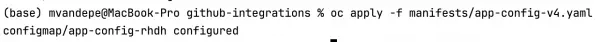

In order to hide the guest login, your environment need to be different from “development”.

In case you would get an error mentioning "the redirect_uri is not associated with this application", then check the following: 

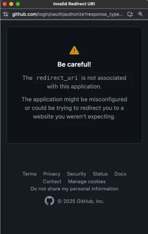


* Check the “baseUrl” field within your rhdh-secrets configuration. It should be similar to

  "https://backstage-developer-hub-demo-project.apps.cluster-5pq52.5pq52.sandbox502.opentlc.com/".
  Check if your domain (i.e., maybe you got a new cluster) is still listed in your GitHub app configuration:

  * Go to your organization settings.
  * Go to GitHub apps.
  * Click edit 

  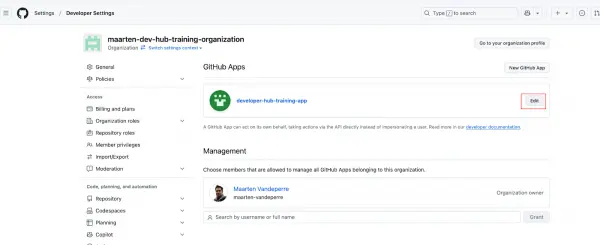

  * Scroll down in general to the callbacks section and check / edit / add your current domain.

    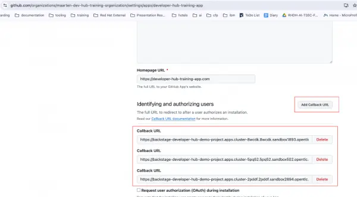

  * Now scroll down to the save button and click "save changes".

<a id="Step_3.4"></a>

### 3.4: Enable GitHub actions (optional)
For now, we will work with public repositories. In case you would have initiated a private repository, you can make it public via repository > settings > general > advanced > change visibility > change to public. In case you are working with private repositories (for now), it can be that the CI tab is showing up, but that it doesn’t contain any workflows. 

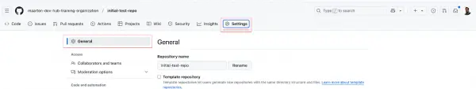

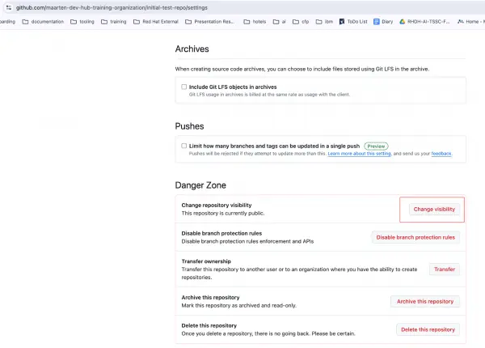

The default CI infrastructure for GitHub is [https://docs.github.com/en/actions/writing-workflows/quickstart](GitHub Actions). We will embed it in our demo application and make it available within Developer Hub. In order to do so, you will need to:

3.4.a. Extend the demo application (or application on which you want to test it, I will reuse the demo-import application from the previous section) with a github actions manifest. This file will be put in the git repository under .github > workflows > github-actions.yaml (you can choose the name of the file, not the directory structure). You can find an [https://github.com/maarten-dev-hub-training-organization/import-demo/commit/3106aa0309b32419c283a460b4fd3b1bc2af6ad9](example in my commit). I’ve added a dummy github actions manifest in our repository as well, you can find it under github-integrations > files > .github > workflows > github-actions-demo.yaml. It doesn’t do anything more than metadata logging, but this is an exercise on enabling the GitHub actions view, not on GitHub actions themselves.

3.4.b. Now we need to enable the GitHub actions plugin in Developer Hub. You can do this by applying the following YAML manifest: (_changes are in between ‘added to enable github actions’_)

```shell
oc apply -f manifests/dynamic-plugins-v5.yaml
```

Expected output:

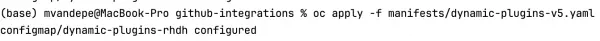

3.4.c. If you check the details of the catalog component, you’ll notice that you don’t see any CI-tab at the moment.

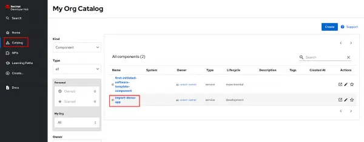

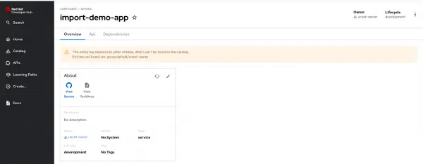

This is not a bug: In order to enable these tabs, you will need to add annotations to the catalog-info.yaml file of the corresponding project. These annotations can enable plugins (if they are installed and configured properly).

3.4.d. We will now configure our project/repository to enable the CI-tab for GitHub Actions. In order to do so, you will need to add the ‘project-slug’ annotation as shown in github-integrations > files > catalog-info.yaml. The slug exists of the organization name and the project name, separated by a forward slash.

> **!!! Important, change the organization name to yours! For me it is 'maarten-dev-hub-training-organization'**

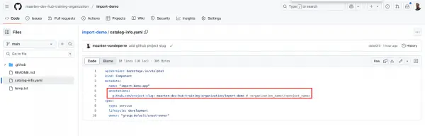

3.4.e. Whenever you now add this or other changes, GitHub Actions will be run on your project. 

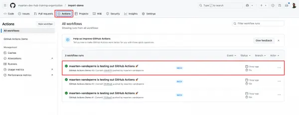

3.4.f. In order to make this now available in Developer Hub, we don’t have anything to do besides refreshing the screen: GitHub integrations and provider is required, which we already configured so far, just like the GitHub authentication provider. Important to note is that you will need to have a GitHub authentication provider configured, but it doesn’t need to be the main authentication method. The authentication provider will kick in whenever you want to open the tab: if you’re not logged in yet, it will ask you to log in before you get to see the pipelines.

3.4.g. When you refresh the screen, you should now be able to see the CI-tab with the past GitHub actions and a button to retrigger the pipeline.

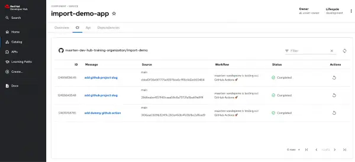


</details>

<a id="Step_4"></a>
<details open>
<summary>Step 4</summary>

## Step 4: Applying software templates / golden path templates
_Source manifest files for the tutorials can be found in this repository:
[https://github.com/maarten-vandeperre/developer-hub-training-exercises](https://github.com/maarten-vandeperre/developer-hub-training-exercises),
which can be cloned in your dev spaces environment. Be aware to change the default namespace 'demo-project'
within these manifest files to your namespace.   
!! In case you went for the Helm based installation,
make sure to use the '-helm' manifest files._

For this exercise, we will make use of the following software template:
* For Operator-based installation: [Open Liberty software template](https://github.com/grace-maarten/platform-engineering-101/blob/main/artefacts/software-templates/liberty-template/template.yaml)
* For Helm-based installation: [Helm Open Liberty software template](https://github.com/grace-maarten/platform-engineering-101/blob/main/artefacts/software-templates/liberty-template/template-helm.yaml)

<a id="Step_4.1"></a>

### 4.1: Get a personal access token from GitHub
In order to be able to initiate a software template, you'll need to make sure that you have a personal access token from GitHub:

* Go to [GitHub profile settings](https://github.com/settings/profile).
* Got to **Developer settings > Personal access tokens > Tokens (classic)**.
* Click **Generate new token > Generate new token (classic)**.
* Add these scopes to the token:
   * **Reading software components:**
     * repo 
   * **Reading organization data:**
     * read:org
     * read:user
     * user:email
   * **Publishing software templates:**
     * repo 
     * workflow (if templates include GitHub workflows)
* Store it somewhere: you'll need it later on when initiating a software template (i.e., within the form of the software template initiation).

<a id="Step_4.2"></a>

### 4.2: Add software template to Developer Hub

The golden path template (i.e. software template) in Developer Hub is a standardized blueprint that helps teams create new projects or services consistently and efficiently. These templates provide pre-configured best practices, coding standards, and integrations tailored to an organization’s needs. Developers can use them to quickly scaffold projects, such as microservices, libraries, or applications, ensuring compliance with organizational guidelines and streamlining onboarding. By promoting reuse and automation, golden path templates accelerate development and reduce cognitive load for developers. 

As a first integration, we will initiate a golden path, also known as a software template. In order to do so, go to "create". When you are logged in with admin permissions, you will have the possibility to add templates to Developer Hub from within this screen.


As for now, we have the opportunity to manually add a software template or to configure it via the app-config file. In order to add it via the app-config file, you can apply the following YAML definition:

``` Shell
oc apply -f manifests/app-config-v2.yaml 
```

Expected output:

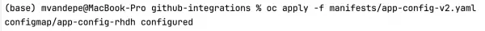

In the updated YAML, I added ‘added to enable software templates’ section to show which configuration was added. It is mainly a location reference and a rule to enable certain catalog entities in Developer Hub (of which Template is one). More on catalog entities in later training exercises. This configuration will make use of the GitHub integrations configuration to enable repository creation in GitHub. It can take a couple of minutes, depending on the processing interval you configured for the template to be imported. You can monitor this in the backstage_plugin_catalog database.

When you execute the debug query, you should be seeing something like this:

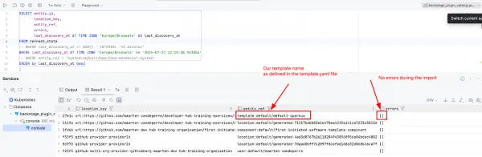

Now that we have the template, we can initiate it.

  * Go to the software template catalog, select the template **Default Quarkus Application** and click **Choose**.

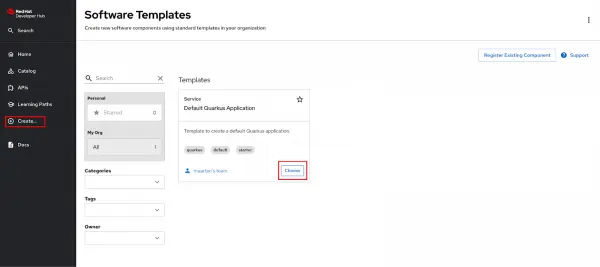

* Fill the section **Repository Information**:

  * Repository name: I opt for "first-initiated-software-template". (I will reuse it as a component name, which will be the name in Developer Hub).
  * Repository owner: The GitHub owner of the repository. For me, it is "maarten-dev-hub-training-organization". You can find it back by going to your repositories in GitHub: E.g., for 'https://github.com/maarten-dev-hub-training-organization/initial-test-repo', it is 'maarten-dev-hub-training-organization'.

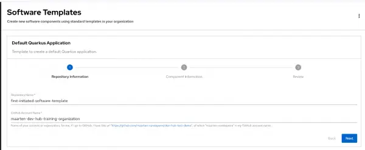

* Fill the section "Component Information":

  * Name: The name of the component in GitHub. I opt for "first-initiated-software-template-component".
  * Owner: The owner within Developer Hub. For now, we didn’t configure any owners, so just fill in a random name. I opt for "unset-owner". When you enter it, it becomes ‘group:default/unset-owner’ automatically.

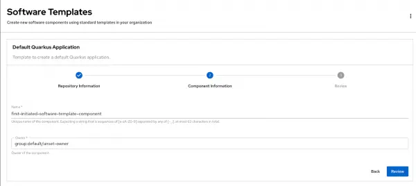

* Click **Review**.

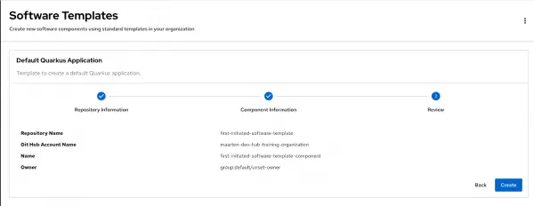

* Click **Create**.


The repository should now be created in GitHub.


In real world use cases, you would add an extra configuration in the template definition that directly adds this component to the component catalog, but for now, when we want to see it in Developer Hub, we will have to wait for the GitHub provider to import the component in Developer Hub.


As we are a one-person organization at the moment, we will need to restrict the security on the projects a bit, in order to modify them (please, don’t do this in real-world scenarios). In order to achieve this:
* Go to the repository
* Go to settings
* Go to branches
* Click **Edit** on the main branch. 


* Uncheck **Require a pull request before merging**. 


* Save changes.


Instructions on how to add software templates to Developer Hub and how to apply them,
can be found in this
[training exercise](https://developers.redhat.com/learning/learn:streamline-development-github-integration-and-software-templates-red-hat-developer-hub/resource/learn:streamline-development-github-integration-and-software-templates-red-hat-developer-hub:resource:prerequisites-and-step-step-guide).
(Section '3.1 Create a repository via a software template').
**!!! Don't forget to use the**
**[Open Liberty software template](https://github.com/grace-maarten/platform-engineering-101/blob/main/artefacts/software-templates/liberty-template/template.yaml)**
**or**
**[Helm Open Liberty software template](https://github.com/grace-maarten/platform-engineering-101/blob/main/artefacts/software-templates/liberty-template/template-helm.yaml)**
**instead of the one mentioned in the exercise.**

In case you run into permission issues: for that repository into your own organization.  
E.g., https://github.com/workshop-devhub/platform-engineering-101/blob/main/artefacts/software-templates/liberty-template/template-helm.yaml
  
When this templates prompt you for a namespace in the second tab, it means the organization within GitHub
  
  
When the template is initiated, go to the GitHub organization's repositories, 
and you'll see that an application repository and a GitOps repository is created.
Go to the application repository and check out the GitHub actions. You can use 
docker build step to fetch the resulting docker image in case you don't have 
ArgoCD enabled. Take this image, go to its details in GitHub and make it public.

Now go to the OpenShift console and create a new application with this docker image.

</details>

<a id="Step_5"></a>
<details open>
<summary>Step 5</summary>

## Step 5: Custom (dynamic) plugins
_Can be, that as admin, you need to:_
* _Check user permissions to create image streams - if you use another namespace than e.g., user13._
  * _oc auth can-i create imagestreams -n user13-devspaces --as=user13_
  * _oc auth can-i create imagestreams -n user13-devspaces --as=user13_

<a id="Step_5.1"></a>

### 5.1: Environment setup
First of all, execute the following commands to prepare the environment (e.g., yarn, npm configs, ...).  
```shell
mkdir -p ~/.npm-global/lib
npm config set prefix ~/.npm-global
```

```shell
export PATH=~/.npm-global/bin:$PATH
echo 'export PATH=~/.npm-global/bin:$PATH' >> ~/.bashrc
source ~/.bashrc
```

```shell
npm install -g yarn
```
<a id="Step_5.2"></a>

### 5.2: Plugin development
Now follow the instructions from [this training exercise](https://github.com/maarten-vandeperre/developer-hub-training-exercises/tree/main/custom-dynamic-plugins)

</details>

<a id="Step_6"></a>
<details open>
<summary>Step 6</summary>

## Step 6: Customizing the Developer Hub instance
Documentation pages:
* https://docs.redhat.com/en/documentation/red_hat_developer_hub/1.4/html/customizing/index
Examples:
* https://github.com/redhat-developer/rhdh/blob/main/app-config.yaml
* https://github.com/redhat-developer/rhdh/blob/main/docker/Dockerfile#L278

**Example:**
```yaml
app-config.yaml: |
  signInPage: github
  app:
    title: My Red Hat Developer Hub Instance
    baseUrl: ${baseUrl}  # base url is coming from the 'secrets_rdhd-secret.yaml' config in 'setting-up-developer-hub-through-the-operator'
    branding:
      fullLogo: data:image/jpeg;base64,/9j/4AAQSkZJRgABAQAAAQABAAD/2wBDAAMCAgICAgMCAgIDAwMDBAYEBAQEBAgGBgUGCQgKCgkICQkKDA8MCgsOCwkJDRENDg8QEBEQCgwSExIQEw8QEBD/2wBDAQMDAwQDBAgEBAgQCwkLEBAQEBAQEBAQEBAQEBAQEBAQEBAQEBAQEBAQEBAQEBAQEBAQEBAQEBAQEBAQEBAQEBD/wAARCAAvADIDAREAAhEBAxEB/8QAHAAAAgICAwAAAAAAAAAAAAAABggHCQABAwQF/8QAMRAAAQIFAgQFBAAHAAAAAAAAAQIDBAUGBxEAEggTITEJFEFhgRUiI1EWMjNScZHx/8QAHAEAAQUBAQEAAAAAAAAAAAAABgADBAUHCAIB/8QAMxEAAQMCAwQIBgIDAAAAAAAAAQIDBAARBSExBhJBUQciYXGBkbHBExQVMqGyI9E0cpL/2gAMAwEAAhEDEQA/ALU9KlS08XHF3A2IhW6QpJqGmNaTFjnJQ79zEtYOQl55IIKlKIOxvIzgqOAAFU2K4qII3G81n8dp/qjzYzYxW0ThkSiUsJOZGqjyHIczw0GeiM0Dc2u7k35oabVzVkynMSuppaR5l4ltvMSjo22MIQPZKRoPakPSZjanlE9YetbjPwqBhGAy2oLSUD4S9BmeqdTqfE06XiDzua0/byk5nJZpFy+LZqQKbiIV9TTiD5V/spJBGiPaha24yFNkg72o7jWVdEUdiVichqQgLSWjcKAI+9PA0G8LnGjNZhN4G3l4ZgmJ88tMPLp6sJQsOnolqJxgEKOAlzAOSArOdwgYLtEtSxGmm98gr2P9+dX+3nRiywwvFMDTYJF1t65cVI45alOeWY0tTtg5GRo1rCK3pUq0rtjSpVR9eKu4q4d3KwrOKeUszOcxS2txJ2sIcLbSR7BtCB8azqasvvrWeJNdT7Px04dhrEZOiUi/eRcnxJNHXDDbqu6uu1Q84kVJzaKlMLUMK9EzJEI4YRlDDqXHSp7GwFKR2znJAxk694fEedkNqQk2Chnwy7aZ2pxmFDwqSy86kLLagE3G8SoECw1zpwPErm8Kxb+jpOpwCJiZ47EIRnqW24ZYUfguoHzq62pUPl0I4k38gf7rPOh9tX1GQ6NA2B4lQI9DSCw8QT9u8jcMZB7aAlIvpXRbTttauDsHV8RXlmqPquMUpcTHSljzC1HJW8gctxR/ypCj861fDHzJhtuq1IF+/SuNtq8PThWNyoaPtStVu45j8Gj/AFOofoQuldeg7M0k9W1xJ6iVypp1DAcLanFuvLztbbQgFS1nB6AdgScAE6aeeQwnfcNhU2Bh8jE3xHip3lH05k8BVGcdHQbs9j4iDUX4Rcc86zvBQXGi6opz6pykj3Gf3oCcAKiRpXTMVxQaSlWRsPO1PDRfiVyyjKIl1IyKwEDL0yuGTDQzEHOy3BoA9QkslfU5JySokklRJzq5RjwZbCEtWtyOXpWeyejhc+SqQ9MJ3jckour9re3ZS6XjvrW196uFW1m+wgsN+XgoGFBTDwbOclKASSST1UonJOOwAAoJ8t2c5vu+A5VpezmBw9nY3y8S+ZupR1Ue3u4Dh33oSh4jqCScD01WKRRU25VoXBBdKg6jtFIrdSWeB2oKbl+6YwTjS21oC3VnegqGHEArA3JJwcZxkaPsAlMuRUR0K6yRmK5r6ScHnRcYexJ9uzTquqq4INgMjbQ2F7GmQ1e1nVIf4s64xFuKCU3v8r/EL4dx/Lv8ovZn3xvx86qMXF2k99H2wKkplu313R+wpQLa8Mlb3VsRO7u0FCRE1mFPz0y9+Uso3uPwgh23FOMp7rcQtwZQOqkk46jBpkwVvsF1vMg6dlH0jaSPh+IohSTZKk33uRuRn2EDXgeyi2k7GPcQs7lMis1Z2pKNi4dAFTTCdR7rsohVAAEshxsPAlQJDZWpXXbgAFevIhfOKCWEFPMnQe9Je0H0FtbuISEug/YEgBZ77G3ja3Hso1uPwbTfh7m0uqStpXOLjUS7lqKXTO6CjIV8j7OYhSXcNk5AUCAexKTjd8kYSYZC3AVo7Mj75UsL22Tjzao8VSWH9R8TrJI42PVz7x4HhxSThWqSqaAr+900pWMoan5XLYqYU5InlOLiHg2ncnmF78nLCUnKlAKcUSQEpHVj6St5pySpO4kAlI4/nh61PVtqzCmxMIbcDzilJS4sWsLmxtbK5PK4SNbmvQ8Ph2Jc4iYcQxXyvocwL2O2z8WM+27b84142eSROFuR9qf6UFJOz5Ctd9Fu/re16tC0e1zbQXdu0NBXvo1+hLiyf6hK3nUPpCHVNOsPIzsdbcSQULGT1HcEg5BI0260h5O4sZVLgzn8OeD8dVlD05GoS8P+kYeg7eXBomHDmyQ3JnktTzFbl8tnkob3H1OwJOffUWAgNoUkcFGrraiSqZIZfVqptB873/NNAAB/3U6hqsIzpUqCb4paNlq+539MUzNCrP6EK4dR5f8Ajuf6n0q0wQkYnGI1+Ij9hUZ8HVhaJthbSQVrL5U4KmqiQwURNIx95TivyNpdLTYPRtG4glIHUgZJwNQcJgNRWUuJHWUBc0QbabRzMYnuRXVfxNrUEgCwyJFzzNuJ8KYPVtQXWiMgj96VKoytZSEXRNf3OhdiBL6jnkPVEIUqBIVEQjTD6SPQ86EWr3Cx76abRuKV2m9TpUgSGmeaU7vkSR+DUnadqDWaVKgS+comdR2lqelZNt87UMCqSslSgkJMUQwVEn0AcJ+NMSUFxlSE6kW88qssHfbiz2pDmiFBX/OftRjK5fCyiWwkqgW9kNBsNw7Kf7UISEpH+gNPJSEgJHCoDjinVlxepNz412tfa8V//9k=
      fullLogoWidth: "110px"
      theme:
        light:
          primaryColor: "#444444"
          headerColor1: "#ffffff"
          headerColor2: "#555555"
          navigationIndicatorColor: "#444444"
        dark:
          primaryColor: "#444444"
          headerColor1: "#ffffff"
          headerColor2: "#555555"
          navigationIndicatorColor: "#444444"
``` 

For image: images/jfokus_50x47.jpeg, encoded by https://www.base64-image.de/

</details>

<a id="Step_7"></a>
<details open>
<summary>Step 7</summary>

## Step 7: Extra information
* Example repository: https://github.com/maarten-vandeperre/developer-hub-documentation

</details>
